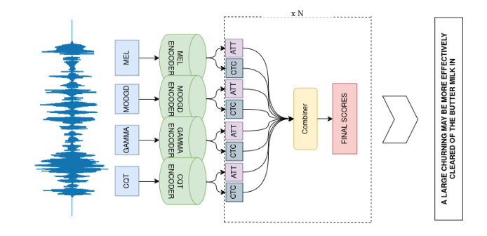

# This is the codebase related to the publication: Late fusion ensembles for speech recognition on diverse input audio representations


 Paper has been accepted to special session on Data Science: Foundations and Applications (DSFA) of conference PAKDD 2025.

## Experiments


- Repo is built on top of `espnet` repository, so there shouldn't be many unknowns.


- Experiments are conducted on 4 datasets
   - Librispeech
   - Aishell1
   - Tedlium_v2
   - GigaSpeech


### Download tokens dictionary for coherent behaviour
```bash
  cd ../espnet/egs2/librispeech/asr1/data/en_token_list/
  gdown --folder --id 1rrr_pymgRQ33YGHdimu15tYEsv0-NnvO?usp=sharing
  ```

### Training model with specific feature type
- Enter `/egs2/librispeech/asr1/conf/tuning` folder and find demo train_asr_e_branchformer.yaml. Within `frontend_conf` switch feat type according to needs. Complete list of features can be found in `/espnet2/layers/log_mel.py`


### Setting up directories for ensemble decoding
- Observe `/egs2/librispeech/asr1/conf/global_mvn_config.yaml` for placement of stats files for each feature.
- Observe python file `evaluate_late_fusion.py` for naming conventions.


### Ensemble inference
- Enter `/egs2/librispeech/asr1/e_conf` folder and find demo sample_config.yaml. You can set which models to use in ensemble, as per needs. Once you correctly place global stats, and models, run ensemble decoding using command `./execute_decoding.sh --inference_nj 3 --inference_tag mel_gamma_bark_late_fusion --path_to_conf e_conf/mel_gamma_bark.yaml`


## Observations
- Enter `/egs2/aishell/asr1` and observe jupyter notebook `Diversity_clean.ipynb`. Results shouldn't be difficult to reproduce.


## Citation
- If you find this work helpful, please cite us


@misc{jezidžić2024latefusionensemblesspeech,
      title={Late fusion ensembles for speech recognition on diverse input audio representations}, 
      author={Marin Jezidžić and Matej Mihelčić},
      year={2024},
      eprint={2412.01861},
      archivePrefix={arXiv},
      primaryClass={eess.AS},
      url={https://arxiv.org/abs/2412.01861}, 
}

This repo is still improving. For any questions, please email marin.jezidzic323@gmail.com

